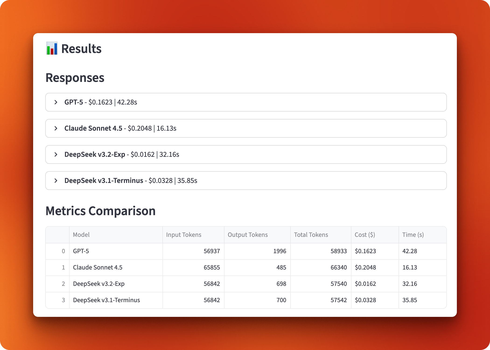

# Multi-Document Research Assistant

A Streamlit application that compares long-context performance across GPT-5, Claude Sonnet 4.5, DeepSeek v3.2-Exp, and DeepSeek v3.1-Terminus.

## Features

- Load multiple PDF documents into a single context
- Compare responses from different LLM providers
- Track and visualize metrics (token usage, API costs, response times)
- Interactive charts comparing model performance

## Demo

The application provides a clean interface for comparing models side by side.


After running queries, you get detailed metrics and visual comparisons.



The comparison charts make it easy to spot cost and performance differences across models.


## Setup

1. Install dependencies:
```bash
uv add streamlit langchain langchain-openai langchain-anthropic langchain-community pypdf tiktoken python-dotenv matplotlib pandas
```

Or using pip:
```bash
pip install -r requirements.txt
```

2. Set up your `.env` file with API keys:
```
OPENAI_API_KEY=your_openai_key
ANTHROPIC_API_KEY=your_anthropic_key
DEEPSEEK_API_KEY=your_deepseek_key
```

## Usage

1. Run the Streamlit app:
```bash
streamlit run app.py
```

2. Click "Load Documents" in the sidebar
3. Select models to compare
4. Enter a question or use a sample question
5. Click "Query Models" to see results and comparisons

## Test Documents

The `documents/` folder contains 3 research papers on attention mechanisms:
- `selective-attention.pdf` (2.4 MB)
- `differential-transformer.pdf` (1.1 MB)
- `sparse-attention-long-range.pdf` (2.2 MB)

Total: ~57,000 tokens

## Project Structure

```
multi-document-qa/
├── app.py                    # Main Streamlit application
├── document_loader.py        # PDF loading and token counting
├── model_config.py          # Model configurations and pricing
├── query_handler.py         # Query processing with metrics
├── test_modules.py          # Test all modules
├── test_with_openai.py      # Quick test with OpenAI
├── requirements.txt         # Python dependencies
├── .env.example            # Template for environment variables
├── documents/              # PDF research papers
└── README.md              # This file
```

## Model Pricing (per 1M tokens)

- **GPT-5**: $2.50 input / $10.00 output
- **Claude Sonnet 4.5**: $3.00 input / $15.00 output
- **DeepSeek v3.2-Exp**: $0.28 input / $0.42 output
- **DeepSeek v3.1-Terminus**: $0.55 input / $2.19 output

## Testing

Run the test script to verify everything works:
```bash
python test_modules.py
```

Or test with a specific model:
```bash
python test_with_openai.py
```

## Checking DeepSeek Balance

If you get "Insufficient Balance" errors with DeepSeek, check your account balance:
```bash
python check_balance.py
```

This will show your current balance and provide instructions for adding credits.

### Adding DeepSeek Credits

1. Visit https://platform.deepseek.com
2. Sign in to your account
3. Navigate to "Billing" or "Credits"
4. Add funds (minimum ~$5 recommended for testing)
5. Wait a few minutes for the balance to update
6. Run `python check_balance.py` again to verify

## Notes

- The application loads all documents into a single context (no chunking/RAG)
- This demonstrates pure long-context handling capabilities
- Ideal for comparing cost and performance on long-context queries
